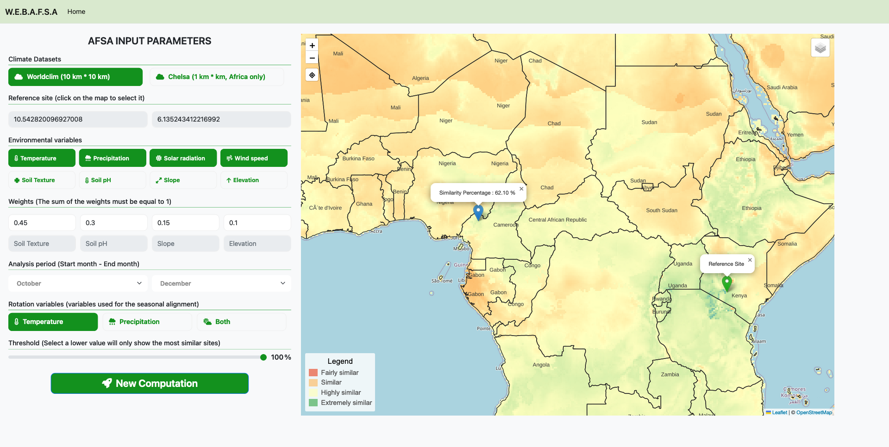

# WebAFSA: Agroecology Fourier-based Similarity Assessment Web Application

WebAFSA is a sophisticated web-based tool designed for agroecological similarity assessments, leveraging the comprehensive methodology of the Agroecology Fourier-based Similarity Assessment (AFSA). This application enables users to visually explore and understand the agroecological landscape's intricacies by generating dynamic similarity maps that depict the relationship between reference sites and other global agroecological locations.

## Features

- **Dynamic Similarity Maps**: Generate and interact with visual maps that display the similarity indices between your selected reference site and other agroecological locations worldwide.
- **User-friendly Interface**: Employing Leaflet for map interactions, Bootstrap for responsive design, and a seamless integration ensuring an engaging and intuitive user experience.
- **Comprehensive Data Management**: Backed by GeoServer for robust database management, allowing for the handling of complex agroecological datasets.
- **Flexible and Customizable**: Powered by the Django Python framework, WebAFSA offers flexibility in parameter customization, including the selection of agroecological datasets, reference sites, and variables of interest.

## Technology Stack

- **Front-end Development**: Leaflet for interactive maps, Bootstrap for responsive UI.
- **Back-end Development**: Django Python framework for handling server-side logic.
- **Database Management**: GeoServer for efficient data storage and retrieval.

## Usage Example

An example application of WebAFSA can be seen in the figure below, where we assess the agroecological similarity of a reference site in Nairobi, Kenya. This feature illustrates how complex agroecological data can be transformed into a clear, understandable format, aiding in informed decision-making.

## License
This project is licensed under the MIT License - see the LICENSE file for details.
